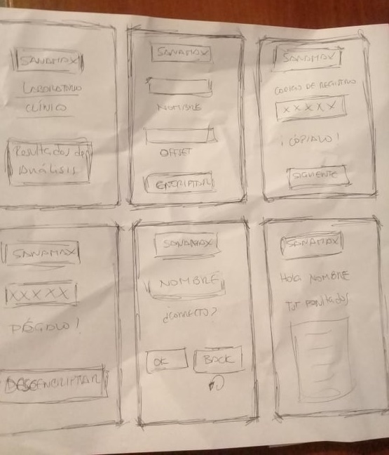
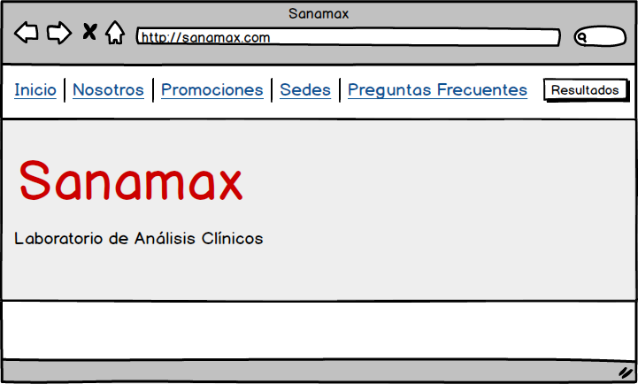
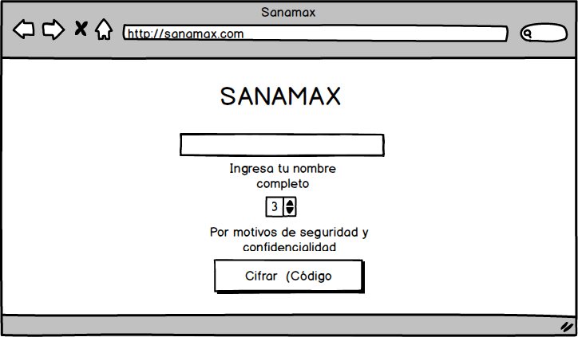
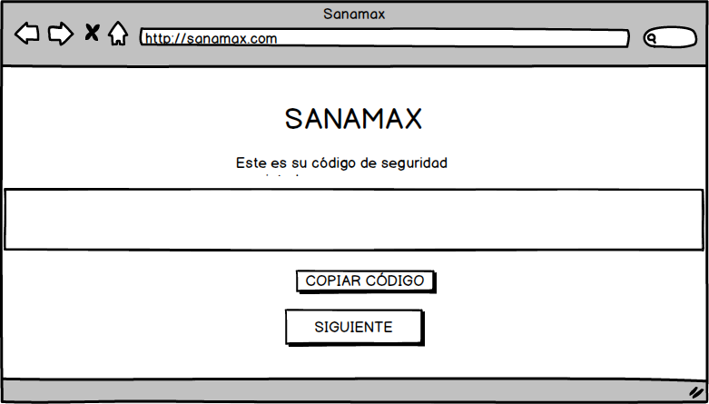
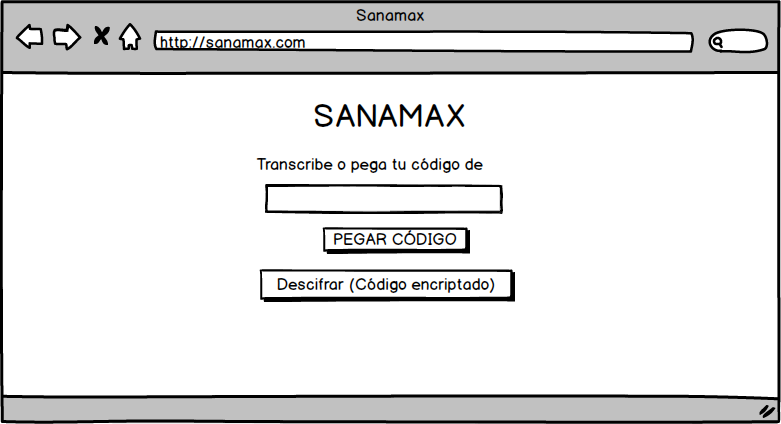
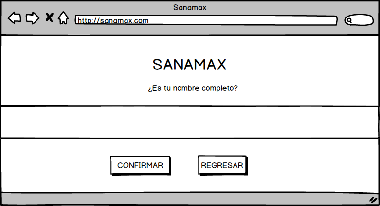

## Un título con el nombre de tu proyecto

Laboratorio de Análisis Clínicos "SANAMAX"

## Un resumen de 1 o 2 líneas de qué se trata tu proyecto.

SANAMAX ofrece a sus pacientes una nueva experiencia al momento de acceder al
resultado de sus análisis. A través de una manera simple y segura.

## La imagen final de tu proyecto.

## Investigación UX:

## 1. Explicar quiénes son los usuarios y los objetivos en relación con el
   producto.

  Los usuarios son los pacientes que concurren el Laboratorio SANAMAX a
  hacerse análisis clínicos.

  Los objetivos propuestos son dos:

  El primero, que el paciente tenga una experiencia nueva, accediendo a sus
  resultados via web de una manera rápida.
  El segundo, es que pueda acceder a sus resultados de una manera segura.

## 2. Explicar cómo el producto soluciona los problemas/necesidades de dichos
   usuarios.

  El primero:
  Algunos laboratorios solo entregaban los resultados de los análisis
  clínicos de manera presencial. Lo que era una molestia para el paciente
  por el tiempo que tendría que invertir en regresar por los resultados.

  El segundo:
  Los pacientes debían crearse un usuario y contraseña en la página web del
  Laboratorio (que debían recordar en el futuro para volver acceder a
  resultados clínicos antiguos o nuevos). En algunos casos el usuario y
  contraseña eran brindados por el mismo laboratorio en el
  recibo/boleta/voucher (que podrían perderse) o por correo electrónico
  (si llegaba bien).

  Solución a los dos problemas identficados:

  Se creará una página web donde el usuario solo deba ingresar su nombre
  completo y escoger un número de seguridad. De esta manera se olvidará ir
  presencialmente al laboratorio a recoger sus resultados. O de
  crear un usuario y password, buscar el documento donde están los
  datos para entrar a la web o esperar el correo de confirmación.

  ¿Cómo funciona?

  Acceder a la página web SANAMAX.com y clickear la pestaña Resultados.
  Ingresa su nombre completo y escoge un número de 1 al 50 (offset).
  Se imprime un texto cifrado y el paciente copia este texto.
  Lo pega para seguidamente descifrarlo.
  Debe imprimir el nombre completo del paciente y si es correcto,
  dar clic al boton confirmar; puede acceder a los resultados de sus
  análisis clínicos.

## 3. Luego colocarás la foto de tu primer prototipo en papel.

    

## 4. Agregar un resumen del feedback recibido indicando las mejoras a realizar.

    Hacer más amigable la home, con background y colores referentes a centros
    de salud.
    Frases cortas pero explicativas para el paciente en donde se tenga que
    llenar campos.

## 5. Imagen del prototipo final.

  
  
  
  
  

  ## Objetivos de aprendizaje Cipher
  ​
  A continuación te presentamos los objetivos de aprendizaje de este proyecto.
  Reflexiona y luego marca los objetivos que has llegado a **entender** y
  **aplicar** en tu proyecto.
  ​
  ### UX
  ​
  - [x] Diseñar la aplicación pensando y entendiendo al usuario.
  - [x] Crear prototipos para obtener feedback e iterar.
  - [x] Aplicar los principios de diseño visual (contraste, alineación, jerarquía).
  ​
  ### HTML y CSS
  ​
  - [x] Uso correcto de HTML semántico.
  - [x] Uso de selectores de CSS.
  - [x] Construir tu aplicación respetando el diseño realizado (maquetación).
  ​
  ### DOM
  ​
  - [x] Uso de selectores del DOM.
  - [x] Manejo de eventos del DOM.
  - [ ] Manipulación dinámica del DOM.
  ​
  ### Javascript
  ​
  - [x] Manipulación de strings.
  - [x] Uso de condicionales (if-else | switch).
  - [ ] Uso de bucles (for | do-while).
  - [x] Uso de funciones (parámetros | argumentos | valor de retorno).
  - [ ] Declaración correcta de variables (const & let).
  ​
  ### Testing
  - [ ] Testeo de tus funciones.
  ​
  ### Git y GitHub
  - [x] Comandos de git (add | commit | pull | status | push).
  - [ ] Manejo de repositorios de GitHub (clone | fork | gh-pages).
  ​
  ### Buenas prácticas de desarrollo
  - [x] Uso de identificadores descriptivos (Nomenclatura | Semántica).
  - [ ] Uso de linter para seguir buenas prácticas (ESLINT).
